```python
import numpy as np
import pandas as pd
import matplotlib.pyplot as plt
import seaborn as sns
from sqlalchemy import create_engine
import plotly.graph_objects as go
from dotenv import load_dotenv
import os
```


```python
load_dotenv()
engine = create_engine(os.getenv("DATABASE_URL"))
```


```python
def compute_errors(df, metrics):
    """Compute MAE and RMSE errors for each metric."""
    summary = {}
    for metric in metrics:
        actual_col = f"{metric}_actual"
        forecast_col = f"{metric}_forecast"
        error_col = f"error_{metric}"

        if actual_col in df.columns and forecast_col in df.columns:
            df[error_col] = df[actual_col] - df[forecast_col]
            summary[metric] = {
                "mae": df[error_col].abs().mean(),
                "rmse": (df[error_col] ** 2).mean() ** 0.5,
            }
    return df, summary

def compute_forecast_error_std(df, metrics, city_filter=None):

    filtered_df = df.copy()
    if city_filter:
        filtered_df = filtered_df[filtered_df['city'] == city_filter]

    results = []
    for metric in metrics:
        actual_col = f"{metric}_actual"
        forecast_col = f"{metric}_forecast"

        if actual_col not in filtered_df.columns or forecast_col not in filtered_df.columns:
            continue

        errors = filtered_df[forecast_col] - filtered_df[actual_col]
        errors = errors.dropna()

        if not errors.empty:
            std_dev = errors.std()
            results.append({
                "city": city_filter or "All",
                "metric": metric,
                "std_dev": round(std_dev, 3),
                "n": len(errors)
            })

    return pd.DataFrame(results)

def plot_metrics_matplotlib(df, metrics, time_col="as_of", city_filter=None):
    """
    Matplotlib chart function for:
    - Actual vs Forecast (if *_actual and *_forecast columns exist)
    - Measured values over time (otherwise)
    """
    filtered_df = df.copy()

    if city_filter:
        filtered_df = filtered_df[filtered_df["city"] == city_filter]

    if filtered_df.empty:
        print(f"No data for city: {city_filter}")
        return

    filtered_df[time_col] = pd.to_datetime(filtered_df[time_col])
    filtered_df = filtered_df.sort_values(time_col)

    for metric in metrics:
        actual_col = f"{metric}_actual"
        forecast_col = f"{metric}_forecast"

        plt.figure(figsize=(10, 5))

        if actual_col in filtered_df.columns and forecast_col in filtered_df.columns:
            df_metric = filtered_df[[time_col, actual_col, forecast_col]].dropna()

            if df_metric.empty:
                print(f"No valid forecast/actual data for {metric}")
                continue

            plt.plot(df_metric[time_col], df_metric[actual_col], marker='o', label=f"Actual {metric}")
            plt.plot(df_metric[time_col], df_metric[forecast_col], marker='x', label=f"Forecast {metric}")
            plt.title(f"{metric.capitalize()} Forecast vs Actual – {city_filter or 'All cities'}")

        elif metric in filtered_df.columns:
            for city in filtered_df["city"].unique():
                city_df = filtered_df[filtered_df["city"] == city]
                plt.plot(city_df[time_col], city_df[metric], marker='o', label=city)
            plt.title(f"{metric.capitalize()} Measured (15-min intervals) – {city_filter or 'All cities'}")

        else:
            print(f"Metric '{metric}' not found.")
            continue

        plt.xlabel("Time")
        plt.ylabel(metric.capitalize())
        plt.xticks(rotation=45)
        plt.legend()
        plt.tight_layout()
        plt.grid(True)
        plt.show()


```


```python
# Load data
forecast_sql = """
    SELECT wf.*
    FROM reporting_data.weather_forecast wf
    INNER JOIN (
        SELECT city, forecast_for, MAX(prediction_generated_at) AS max_generated
        FROM reporting_data.weather_forecast
        GROUP BY city, forecast_for
    ) latest
    ON wf.city = latest.city
    AND wf.forecast_for = latest.forecast_for
    AND wf.prediction_generated_at = latest.max_generated
    ORDER BY wf.city, wf.forecast_for
"""
forecast_df = pd.read_sql(forecast_sql, engine)
current_df_full = pd.read_sql("SELECT * FROM reporting_data.weather_current", engine)

# Convert timestamps to datetime
forecast_df["forecast_for"] = pd.to_datetime(forecast_df["forecast_for"])
forecast_df["forecast_for_hour"] = forecast_df["forecast_for"].dt.floor("h")

current_df_full["as_of"] = pd.to_datetime(current_df_full["as_of"])

# Filter actual observations to full hours only
current_df = current_df_full[current_df_full["as_of"].dt.minute == 0].copy()
current_df["as_of_hour"] = current_df["as_of"]

# Merge actual and forecast data on city and hour
df = pd.merge(
    current_df,
    forecast_df,
    left_on=["city", "as_of_hour"],
    right_on=["city", "forecast_for_hour"],
    suffixes=("_actual", "_forecast")
)

# Define metrics to compare
metrics = ['temp_c', 'wind_kph', 'humidity', 'precip_mm', 'pressure_mb', 'cloud', 'feelslike_c']

# Compute deltas between forecast and actual values
for metric in metrics:
    df[f"delta_{metric}"] = df[f"{metric}_forecast"] - df[f"{metric}_actual"]

```


```python
# DATA sample
df.head(2)
```


<div>
<style scoped>
    .dataframe tbody tr th:only-of-type {
        vertical-align: middle;
    }

    .dataframe tbody tr th {
        vertical-align: top;
    }

    .dataframe thead th {
        text-align: right;
    }
</style>
<table border="1" class="dataframe">
  <thead>
    <tr style="text-align: right;">
      <th></th>
      <th>id_actual</th>
      <th>city</th>
      <th>as_of</th>
      <th>temp_c_actual</th>
      <th>temp_f_actual</th>
      <th>is_day_actual</th>
      <th>condition_text_actual</th>
      <th>condition_icon_actual</th>
      <th>condition_code_actual</th>
      <th>wind_mph_actual</th>
      <th>...</th>
      <th>prediction_generated_at</th>
      <th>fetched_at_forecast</th>
      <th>forecast_for_hour</th>
      <th>delta_temp_c</th>
      <th>delta_wind_kph</th>
      <th>delta_humidity</th>
      <th>delta_precip_mm</th>
      <th>delta_pressure_mb</th>
      <th>delta_cloud</th>
      <th>delta_feelslike_c</th>
    </tr>
  </thead>
  <tbody>
    <tr>
      <th>0</th>
      <td>17</td>
      <td>Prague</td>
      <td>2025-07-12 16:00:00</td>
      <td>18.1</td>
      <td>64.6</td>
      <td>1</td>
      <td>Light drizzle</td>
      <td>//cdn.weatherapi.com/weather/64x64/day/266.png</td>
      <td>1153</td>
      <td>3.4</td>
      <td>...</td>
      <td>2025-07-12 20:15:03.188438</td>
      <td>2025-07-12 20:15:03.186395</td>
      <td>2025-07-12 16:00:00</td>
      <td>-3.6</td>
      <td>2.5</td>
      <td>14</td>
      <td>0.48</td>
      <td>1.0</td>
      <td>77</td>
      <td>-3.8</td>
    </tr>
    <tr>
      <th>1</th>
      <td>18</td>
      <td>London</td>
      <td>2025-07-12 16:00:00</td>
      <td>30.4</td>
      <td>86.7</td>
      <td>1</td>
      <td>Sunny</td>
      <td>//cdn.weatherapi.com/weather/64x64/day/113.png</td>
      <td>1000</td>
      <td>10.5</td>
      <td>...</td>
      <td>2025-07-12 20:15:03.624644</td>
      <td>2025-07-12 20:15:03.622063</td>
      <td>2025-07-12 16:00:00</td>
      <td>-1.5</td>
      <td>1.5</td>
      <td>-3</td>
      <td>0.00</td>
      <td>-1.0</td>
      <td>8</td>
      <td>-1.5</td>
    </tr>
  </tbody>
</table>
<p>2 rows × 77 columns</p>
</div>


####  Forecast Error Summary

This summary evaluates the accuracy of weather forecasts compared to actual measured data. Two key error metrics are used:

- **MAE (Mean Absolute Error):** Represents the average size of prediction errors, regardless of direction.
- **RMSE (Root Mean Squared Error):** Penalizes larger errors more heavily and emphasizes outliers.

Lower values indicate more accurate predictions. In general, temperature, wind speed, and pressure forecasts are reasonably accurate. Larger discrepancies are seen in cloud cover and humidity, which are more variable and harder to predict precisely.


```python

metrics_to_compare = ['temp_c', 'wind_kph', 'humidity', 'precip_mm',
                      'pressure_mb', 'cloud', 'feelslike_c']
comparison_df, summary = compute_errors(df, metrics_to_compare)
pd.DataFrame(summary).T


```


<div>
<style scoped>
    .dataframe tbody tr th:only-of-type {
        vertical-align: middle;
    }

    .dataframe tbody tr th {
        vertical-align: top;
    }

    .dataframe thead th {
        text-align: right;
    }
</style>
<table border="1" class="dataframe">
  <thead>
    <tr style="text-align: right;">
      <th></th>
      <th>mae</th>
      <th>rmse</th>
    </tr>
  </thead>
  <tbody>
    <tr>
      <th>temp_c</th>
      <td>2.028571</td>
      <td>2.315476</td>
    </tr>
    <tr>
      <th>wind_kph</th>
      <td>0.978571</td>
      <td>1.902067</td>
    </tr>
    <tr>
      <th>humidity</th>
      <td>7.928571</td>
      <td>11.106626</td>
    </tr>
    <tr>
      <th>precip_mm</th>
      <td>0.092143</td>
      <td>0.181443</td>
    </tr>
    <tr>
      <th>pressure_mb</th>
      <td>0.428571</td>
      <td>0.654654</td>
    </tr>
    <tr>
      <th>cloud</th>
      <td>12.928571</td>
      <td>22.666842</td>
    </tr>
    <tr>
      <th>feelslike_c</th>
      <td>2.207143</td>
      <td>2.419416</td>
    </tr>
  </tbody>
</table>
</div>


```python

compute_forecast_error_std(df, metrics_to_compare, city_filter="Prague")
```


<div>
<style scoped>
    .dataframe tbody tr th:only-of-type {
        vertical-align: middle;
    }

    .dataframe tbody tr th {
        vertical-align: top;
    }

    .dataframe thead th {
        text-align: right;
    }
</style>
<table border="1" class="dataframe">
  <thead>
    <tr style="text-align: right;">
      <th></th>
      <th>city</th>
      <th>metric</th>
      <th>std_dev</th>
      <th>n</th>
    </tr>
  </thead>
  <tbody>
    <tr>
      <th>0</th>
      <td>Prague</td>
      <td>temp_c</td>
      <td>1.048</td>
      <td>8</td>
    </tr>
    <tr>
      <th>1</th>
      <td>Prague</td>
      <td>wind_kph</td>
      <td>2.503</td>
      <td>8</td>
    </tr>
    <tr>
      <th>2</th>
      <td>Prague</td>
      <td>humidity</td>
      <td>12.165</td>
      <td>8</td>
    </tr>
    <tr>
      <th>3</th>
      <td>Prague</td>
      <td>precip_mm</td>
      <td>0.199</td>
      <td>8</td>
    </tr>
    <tr>
      <th>4</th>
      <td>Prague</td>
      <td>pressure_mb</td>
      <td>0.518</td>
      <td>8</td>
    </tr>
    <tr>
      <th>5</th>
      <td>Prague</td>
      <td>cloud</td>
      <td>31.437</td>
      <td>8</td>
    </tr>
    <tr>
      <th>6</th>
      <td>Prague</td>
      <td>feelslike_c</td>
      <td>0.966</td>
      <td>8</td>
    </tr>
  </tbody>
</table>
</div>


####  Measured values 


```python
plot_metrics_matplotlib(current_df_full, metrics=metrics_to_compare, time_col="as_of", city_filter="London")
```


    
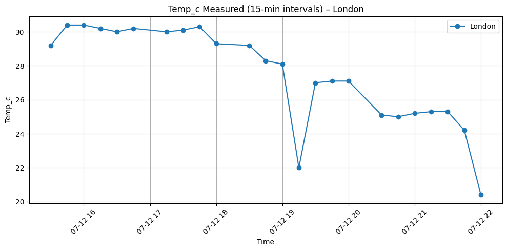
    


    
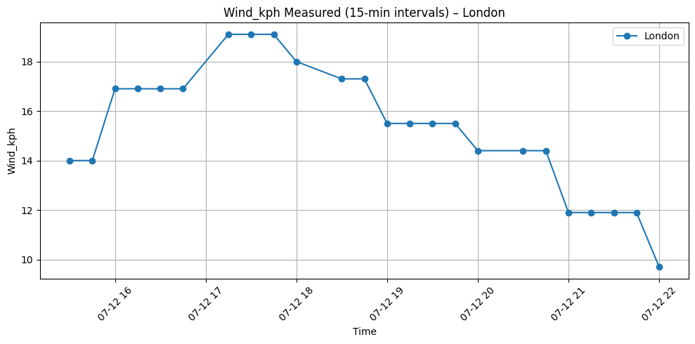
    


    
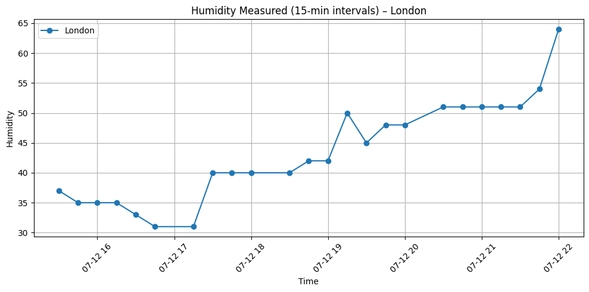
    


    
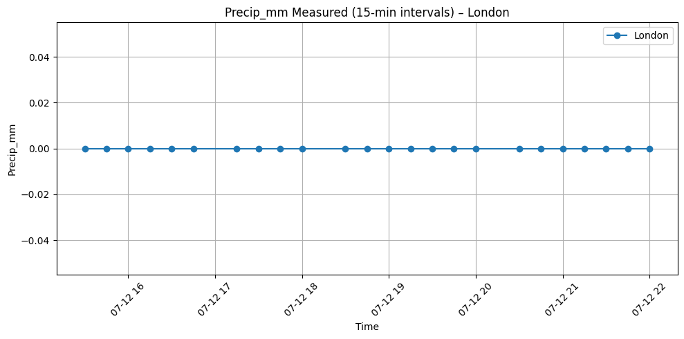
    


    
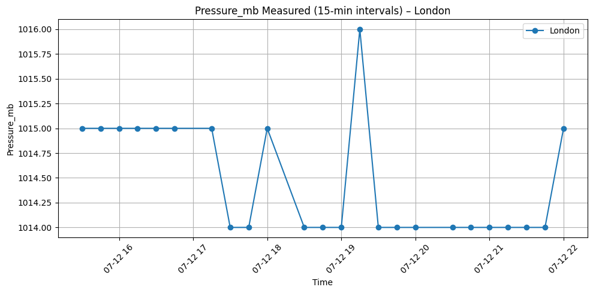
    


    
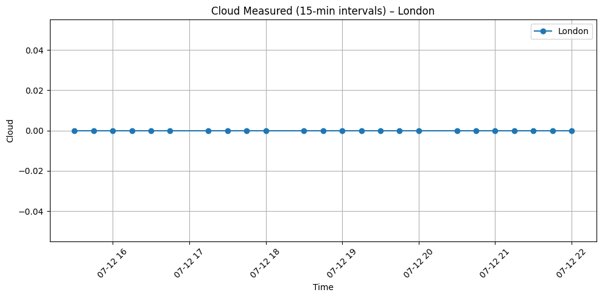
    


    
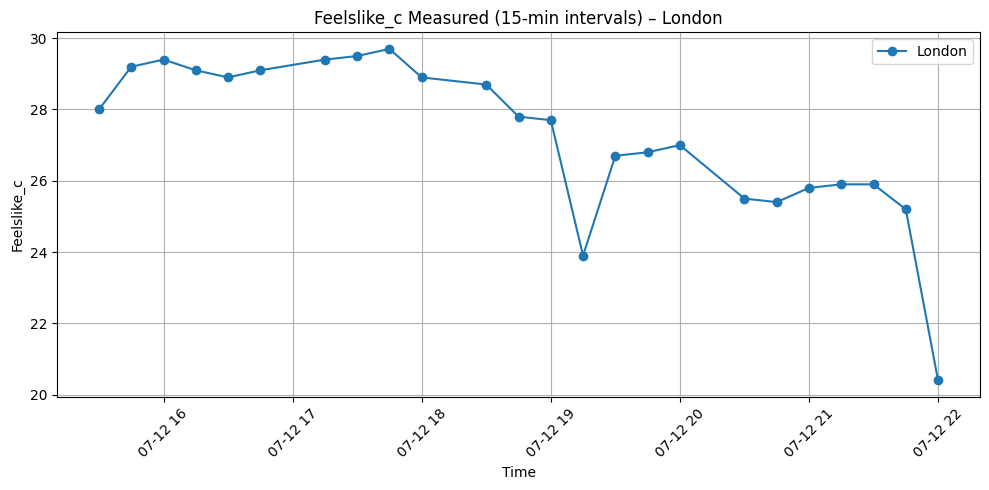
    


#### Comparison of measured value vs predicted value


```python
plot_metrics_matplotlib(df, metrics=metrics_to_compare, time_col="as_of", city_filter="Prague")

```


    
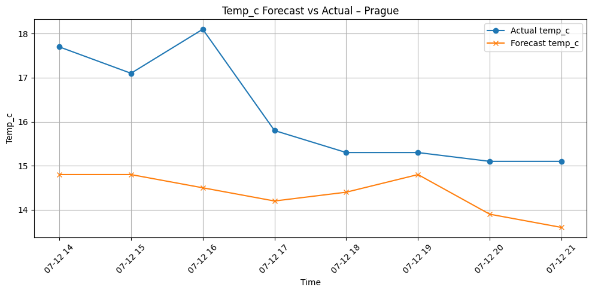
    


    
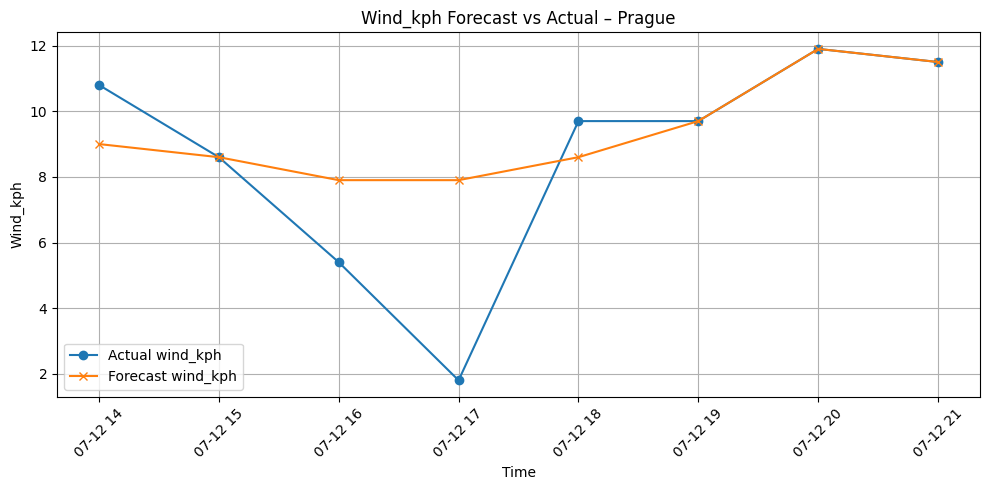
    


    
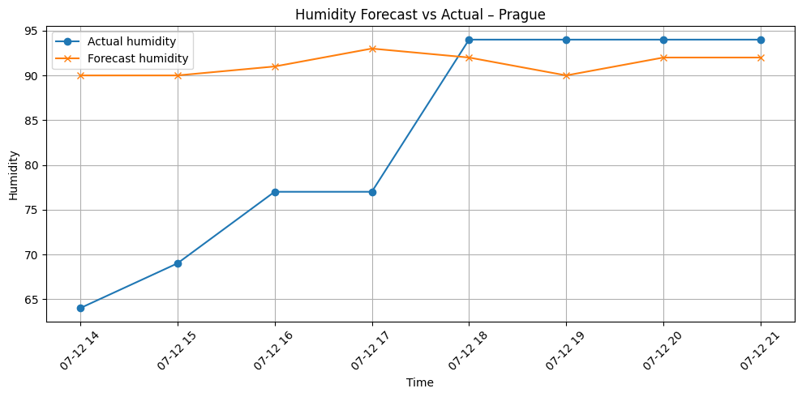
    


    
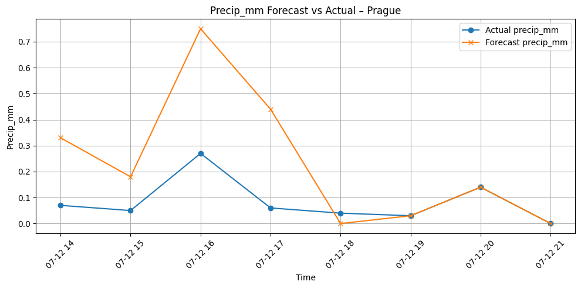
    


    
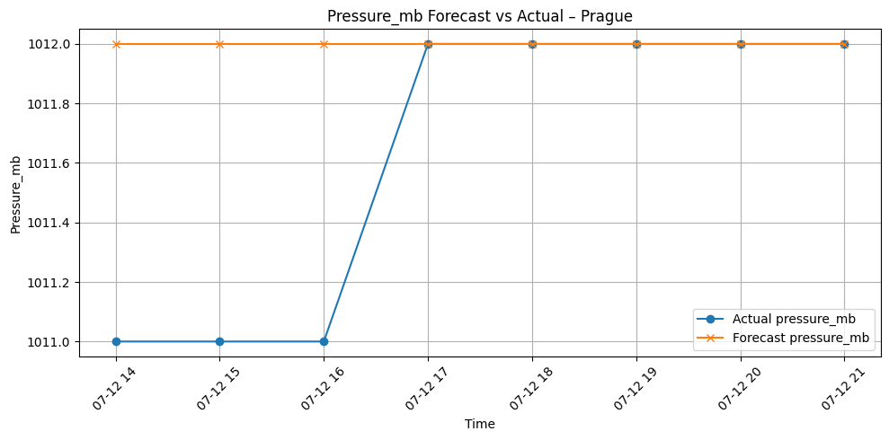
    


    
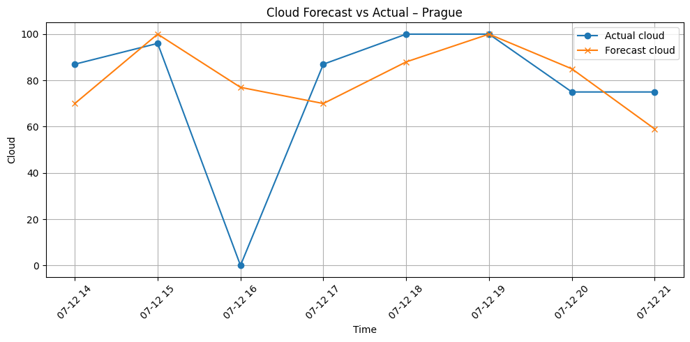
    


    
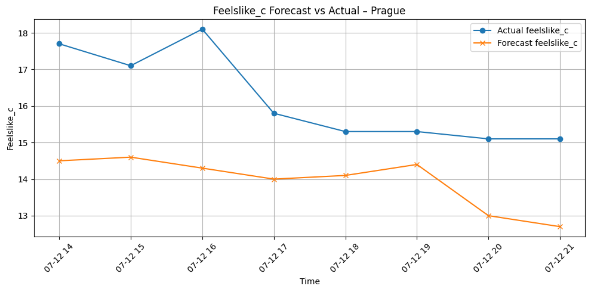
    

